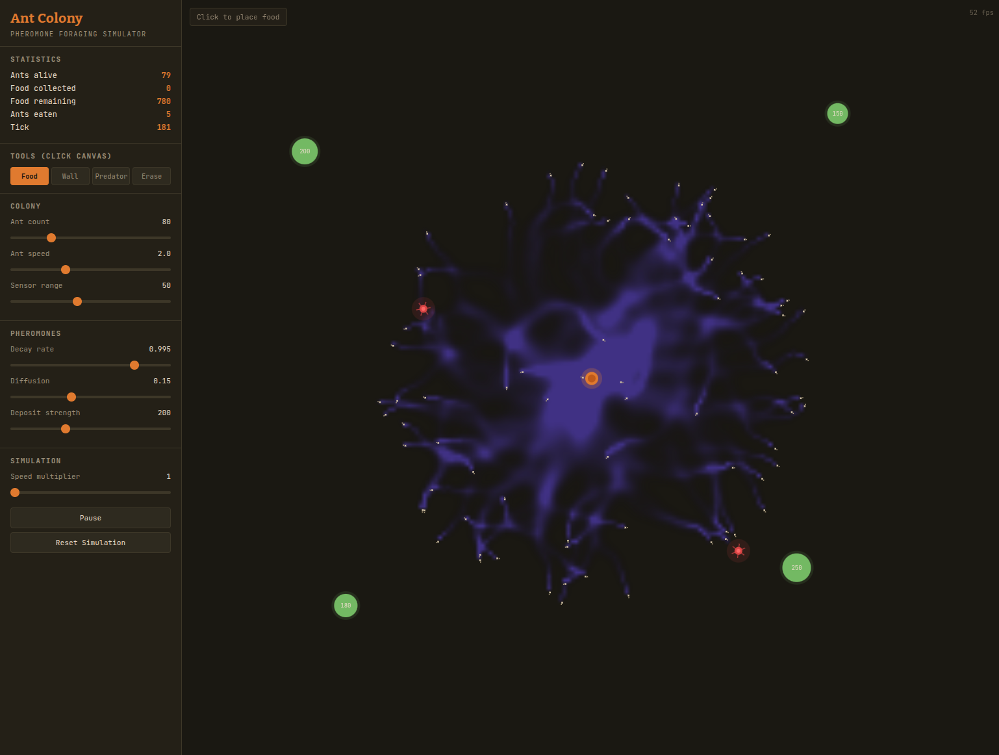

# Ant Colony

**[Live Demo](https://iloire.github.io/ant-colony/)**



A real-time 2D ant colony foraging simulator built with HTML5 Canvas. Watch ants discover food sources, lay pheromone trails, and collectively optimize foraging paths — an emergent behavior arising from simple individual rules.

## How It Works

Each ant follows three simple rules:

1. **Wander** randomly until food or a pheromone trail is found
2. **Pick up food** and turn back toward the colony
3. **Deposit pheromones** along the return path so others can follow

Pheromones **decay** over time and **diffuse** into neighboring cells. Shorter paths accumulate stronger trails because ants traverse them faster, reinforcing the signal before it fades. The colony converges on optimal routes without any central coordination.

## Running

```sh
# Any static file server works
python3 -m http.server 8080

# Then open http://localhost:8080
```

No build step, no dependencies — it's a single `index.html`.

## Controls

### Placement Tools

| Tool | Action |
|------|--------|
| **Food** | Click to drop a food source (100–250 units) |
| **Wall** | Click/drag to paint obstacle walls |
| **Predator** | Click to place a wandering predator |
| **Erase** | Click/drag to remove walls, food, and predators |

### Tunable Parameters

| Parameter | Range | Effect |
|-----------|-------|--------|
| Ant count | 10–300 | Colony population (dead ants respawn gradually) |
| Ant speed | 0.5–5.0 | Movement speed per tick |
| Sensor range | 15–100 | How far ahead ants can detect pheromones |
| Decay rate | 0.980–0.999 | How quickly pheromones evaporate (higher = slower) |
| Diffusion | 0.0–0.4 | How much pheromone spreads to adjacent cells |
| Deposit strength | 50–500 | Pheromone intensity per ant step |
| Speed multiplier | 1–5x | Simulation ticks per frame |

## Entities

### Colony (orange circle, center)
Home base. Ants spawn here and return with collected food. The colony tracks total food gathered.

### Food Sources (green circles)
Finite supply shown as a number. Shrinks as ants collect from it. Disappears when depleted. Place more with the Food tool.

### Predators (red spiders)
Wander the map and kill ants within their radius. The colony compensates by spawning replacements, but heavy predator pressure reduces foraging efficiency.

### Obstacles (brown walls)
Block ant movement and pheromone diffusion. Use them to create mazes, corridors, or force ants to find alternate routes.

## Pheromone System

Two independent pheromone layers are simulated on a grid:

- **Food pheromone** (green) — deposited by ants carrying food back to the colony. Guides foragers toward discovered food sources.
- **Home pheromone** (blue) — deposited by exploring ants. Helps food-carrying ants navigate back to the colony.

Both layers undergo per-tick **exponential decay** and **4-neighbor diffusion**, creating smooth gradient fields that ants follow using three directional sensors (forward, left, right).

## Things to Try

- Draw a wall maze between the colony and a food source — watch ants solve it
- Place food at varying distances — the colony will favor the closest source
- Ring the colony with predators and see if foragers can survive
- Crank diffusion to max and watch pheromone clouds bloom
- Set decay very low (0.980) and see trails vanish before paths can form
- Place a wall halfway through an established trail — ants reroute around it

## Architecture

Single-file vanilla JavaScript application (~860 lines). No frameworks, no build tools.

| Component | Description |
|-----------|-------------|
| Pheromone grid | Two `Float32Array` grids with per-cell diffusion and decay |
| Obstacle grid | `Uint8Array` marking impassable cells |
| Ant steering | 3-sensor model comparing pheromone intensity at forward/left/right |
| Rendering | Offscreen canvas for pheromone heatmap, composited onto main canvas |
| UI | Sidebar with live stats, tool buttons, and range sliders |
